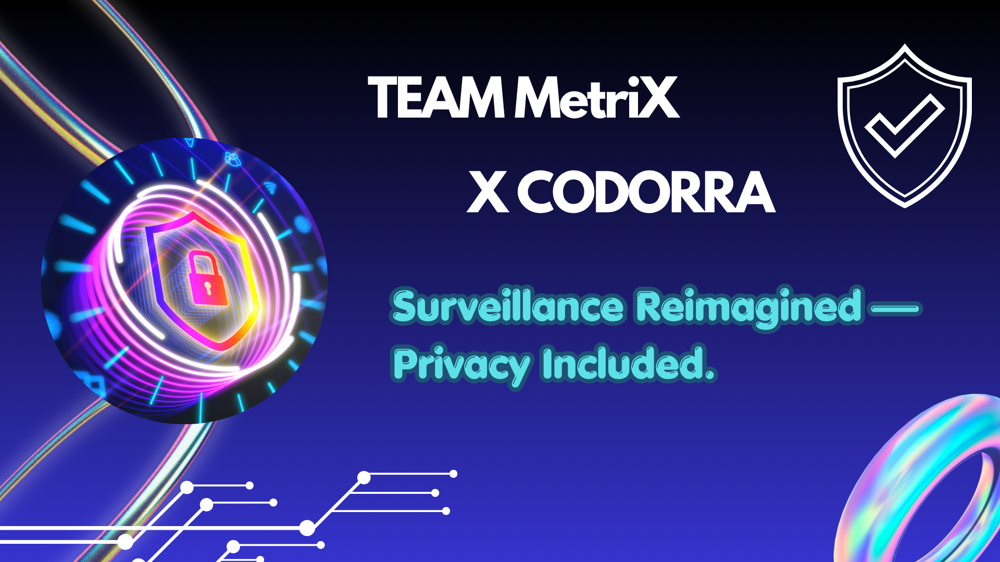
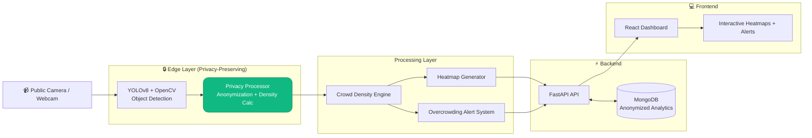

# 👥 CrowdGuard: Privacy-Preserving Crowd Density Estimator

**Smart AI-Powered Monitoring for Safer Public Spaces**  
**Mass Surveillance vs Public Safety Hackathon** | 48-Hour Build

  

 *Monitor Density.Preserve Dignity*
<!-- Replace with actual banner image once designed -->

---

## 🏆 Team Title

**MetriX**  
**Privacy-First AI Innovators**

---

## 📋 Problem Statement & Research Insights

**The Challenge**:  
Modern smart cities face a critical tension — **mass surveillance for public safety** versus **citizen privacy**. Traditional crowd monitoring systems often rely on facial recognition, identity tracking, and centralized raw video storage, leading to:

- **Privacy Erosion**: Constant tracking raises concerns about mass surveillance, data breaches, and misuse (e.g., mission creep beyond safety).
- **Public Safety Risks**: Overcrowding in public spaces (events, transit hubs, markets) can lead to stampedes, chaos, or emergencies. Studies show real-time density monitoring can prevent disasters.
- **Bias & Inefficiency**: Systems trained on biased data over-police certain areas; raw footage storage increases breach risks.

**Global Context** (2025-2026):
- Cities worldwide (Singapore, Ahmedabad, New York) deploy AI crowd systems for safety, yet privacy regulations like GDPR and growing public distrust demand **Privacy-by-Design**.
- Research highlights the need for **edge processing**, **anonymization**, and **density estimation without PII** (Personally Identifiable Information).
**Our Solution Addresses This Head-On**: A privacy-first system that delivers actionable safety insights **without compromising individual rights**.

---

## 🚀 Solution Approach

**CrowdGuard** uses **anonymous computer vision** to estimate crowd density, detect overcrowding risks, generate heatmaps, and send real-time alerts — all while ensuring **zero facial recognition** and **no identity tracking**.

### Key Differentiators
- **Privacy-First**: Processes data at the edge; only aggregated, anonymized metrics are stored/transmitted.
- **Real-Time & Actionable**: Heatmaps + alerts for unsafe conditions.
- **Ethical AI**: Fully auditable, transparent, and compliant with privacy best practices.

---

## 🛠️ Tech Stack & Reasoning

| Component       | Technology                  | Why We Chose It |
|-----------------|-----------------------------|-----------------|
| **Backend**    | **FastAPI**                | Excellent AI integration, native async support, built-in Swagger docs, Python ecosystem, and fastest hackathon development speed. Superior to Express for AI-heavy workloads. |
| **Frontend**   | **ReactJS**                | Fast, component-based UI for interactive dashboards, heatmaps, and real-time updates. |
| **Database**   | **MongoDB**                | Flexible schema for storing anonymized analytics, heatmaps, and alerts. Perfect for FARM stack scalability. |
| **AI Engine**  | **YOLO (v8+)** + **OpenCV** | State-of-the-art real-time object detection for people counting/density. Lightweight, accurate, and runs efficiently on edge devices. |
| **Heatmaps & Analytics** | OpenCV + Matplotlib/Seaborn | Fast generation of visual insights from anonymized data. |
| **Deployment** | Docker (recommended)       | Easy reproducibility and scalability. |

**Why this stack?** It aligns perfectly with your architecture decision — **AI-heavy**, rapid prototyping in 48 hours, and production-ready.

---
## 🏗️ System Architecture & Data Flow

    
**Workflow**:
1. Video stream processed locally/on-edge.
2. YOLO detects people → count & density calculated (no identities).
3. Heatmap generated and alerts triggered if thresholds exceeded.
4. Anonymized data saved → visualized on dashboard.

---

## ✨ Key Features & Innovation

**MUST-HAVE MVP Features**:
- Real-time **Crowd Density Detection**
- **Overcrowding Risk Alerts**
- **Privacy-Preserving Heatmaps**
- **Anonymous Analytics Dashboard**

**Innovation Highlights**:
- **Zero Identity Tracking** — Strong differentiator vs. traditional surveillance.
- **Edge-First Processing** — Minimizes data centralization risks.
- **Ethical Transparency** — Built-in audit logs and privacy metrics.

---

## 🔮 Future Scope & Scalability

- Multi-camera support with Federated Learning.
- Integration with IoT sensors and smart city platforms.
- Mobile app for authorities/citizens (privacy-controlled views).
- Advanced anomaly detection (e.g., panic movement patterns).
- Cloud/On-Prem deployment options for global cities.

**Potential Impact**: Deployable in malls, stadiums, transit hubs, and festivals worldwide — balancing safety and civil liberties.

---

## Demo & Conclusion

### Demo link

### 🎯 Conclusion
CrowdGuard proves that public safety and privacy can coexist. By using edge AI and privacy-by-design, we built a system that protects lives in crowded spaces without enabling mass surveillance.
*A balanced, ethical solution for modern smart cities.*

