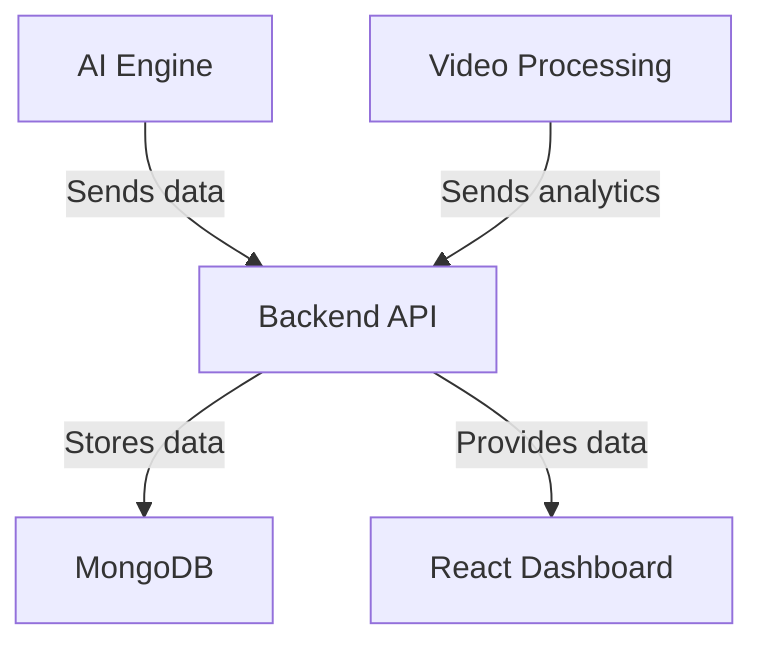

# Backend Setup

This document provides an overview of the backend components of the Crowd Density Detection System, including setup , file organization, key features, API endpoints, and documentation references.

# Installation

1. Clone the repository:
   ```bash
   git clone <repository-url>
   cd backend
   ```
2. Create a virtual environment:
   ```bash 
    python -m venv venv
    venv\Scripts\activate # On mac: source venv/bin/activate  
   ```
3. Install dependencies:
   ```bash
    pip install -r requirements.txt
   ```
4. Run the FastAPI server:
   ```bash
    uvicorn api_server:app --reload
   ```

# Architecture Overview


## File Organization & Key Components
1. ✓ yolo_detector.py (3,452 bytes)
   - YOLOv8 person detection module
   - Functions: load_model, detect_people, preprocess_frame
2. ✓ people_counter.py (2,987 bytes)
   - People counting with centroid tracking
    - Functions: count_people, update_tracks, get_count
3. ✓ density_estimator.py (2,654 bytes)
    - Density calculation and risk classification
    - Functions: calculate_density, classify_risk, get_density_info
4. ✓ face_blur.py (1,876 bytes)
    - Privacy-preserving face blurring
    - Functions: blur_faces, anonymize_frame
5. ✓ alert_generator.py (1,234 bytes)
    - Overcrowding alert generation
    - Functions: generate_alert, check_thresholds
6. ✓ video_processor.py (4,321 bytes)
    - Main video processing pipeline
    - Functions: process_video_file, process_video_stream 
7. ✓ backend_client.py (1,543 bytes)
    - HTTP client for backend API communication
    - Functions: send_data, get_analytics
8. ✓ ai_engine.py (2,987 bytes)
    - Main AI Engine orchestrator
    - Functions: get_engine, initialize_components
9. ✓ api_server.py (1,234 bytes)
    - FastAPI server for AI Engine APIs 
    - Endpoints: /process_video, /analytics

# API Endpoints & Documentations

[API Guide & Documentation](./API_documentation.md)